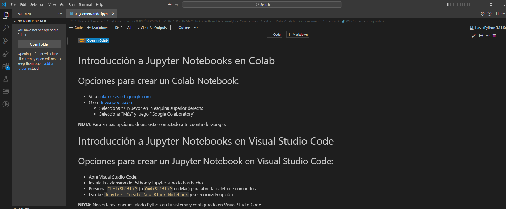

# Curso Basico Python
Curso Practico Basico para CMF

## ¿Para Quién es Este Curso?

- Perfecto para principiantes "desde cero" 👶 inquietos por analizar su primer conjunto de datos.
- También para aficionados a los datos 🤓 que buscan simplificar su análisis.

## 🚫 No Se Necesita Experiencia Previa:
Iremos desde cero, desde conocer el entorno hasta un proyecto final, Si puedes manejar excel nivel usuario, estás listo.

## 🚫 Absolutamente Sin Requisitos Previos:
Repetición para tranquilidad 😬.

## ✅ Intentaré cubrir dudas y conceptos necesarios para el Curso:
Desde conceptos fundamentales hasta análisis avanzados.

## Tabla de Contenidos

### Capítulo 1: Conceptos Básicos de Python
Este capítulo está diseñado para Google Colab.

- Introducción a Python
- Variables
- Tipos de Datos
- Operadores
- Funciones
- Clases
- Bibliotecas Estándar de Python
- Bibliotecas para Ciencia de Datos
  - Numpy
  - Matplotlib
  - Pandas

### Capítulo 2: Python II
- Pandas Avanzado
  - Limpieza de Datos
  - Manipulación de Datos
  - Visualización de Datos
- Matplotlib Avanzado
  - Gráficos Estadísticos
  - Personalización de Gráficos
  - Subgráficos

